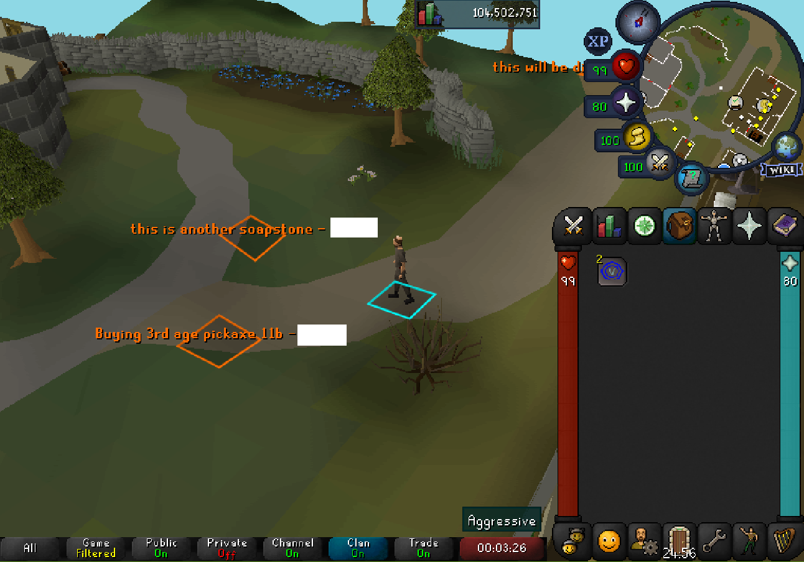

# OSRS Soapstones


These are just persistent tiles places by everyone.

Shared over all worlds, over all areas by everyone.

Right-click with shift to place a soapstone.

## Configuration
You need your own backend to receive and return the tiles between your friends.

A master server option is possible once we have the funds to provide one as a configuration option.

- URL
  - The URL the plugin will perform GET and POST requests to in order to save or get soapstones.

## Endpoints
### GET
It needs to return this payload.
```json
[
  {
    "message": "Content of the message.",
    "username": "Username2016",
    "worldPoint": {
      "x": 3156,
      "y": 3500,
      "plane": 0
    }
  },
  {
    "message": "Content of the message.",
    "username": "Username2016",
    "worldPoint": {
      "x": 3155,
      "y": 3500,
      "plane": 0
    }
  }
]
```

### POST
It needs to save this payload.
```json
{
  "message": "Content of the message.",
  "username": "Username2016",
  "worldPoint": {
    "x": 3156,
    "y": 3500,
    "plane": 0
  }
}
```

## TODO:
- Shift right-click on existing tile, upvote/downvote soapstone.
- Soap Stone tiles keep flashing because of full list refresh.
- Use a lighter orange color.
- Limit Soap Stones per user per 5 minutes.
- Create handshake (e.g. join a discord and get an API key to configure inside the plugin)
- Profanity filter (optional)